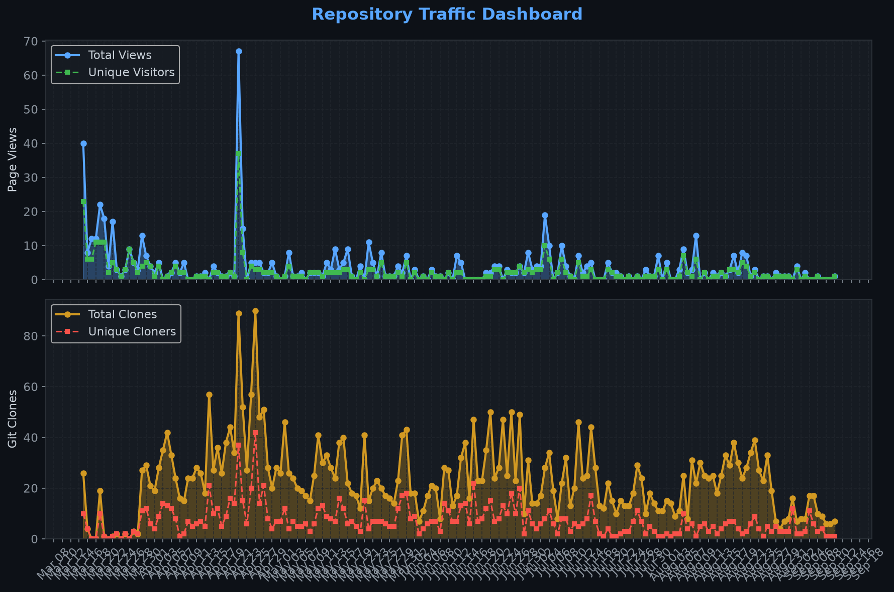
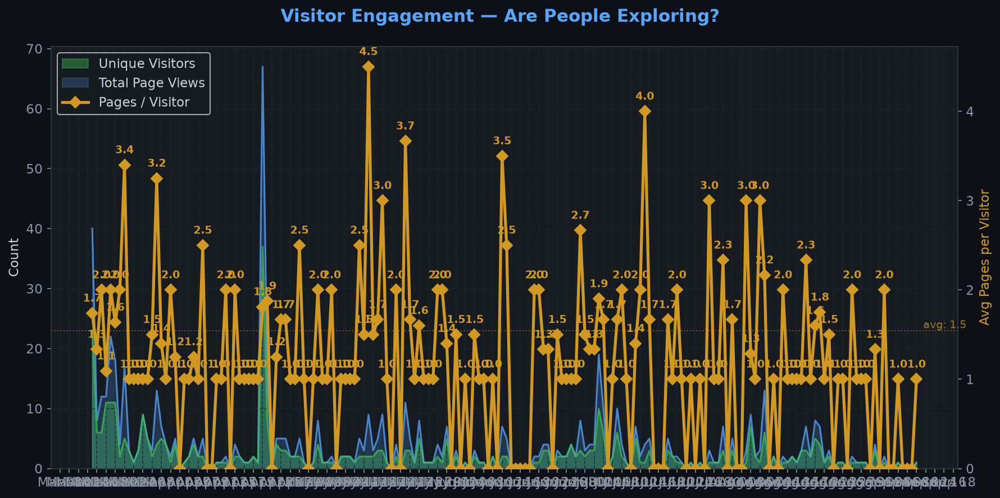
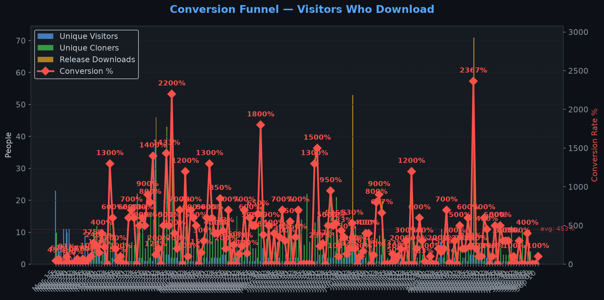
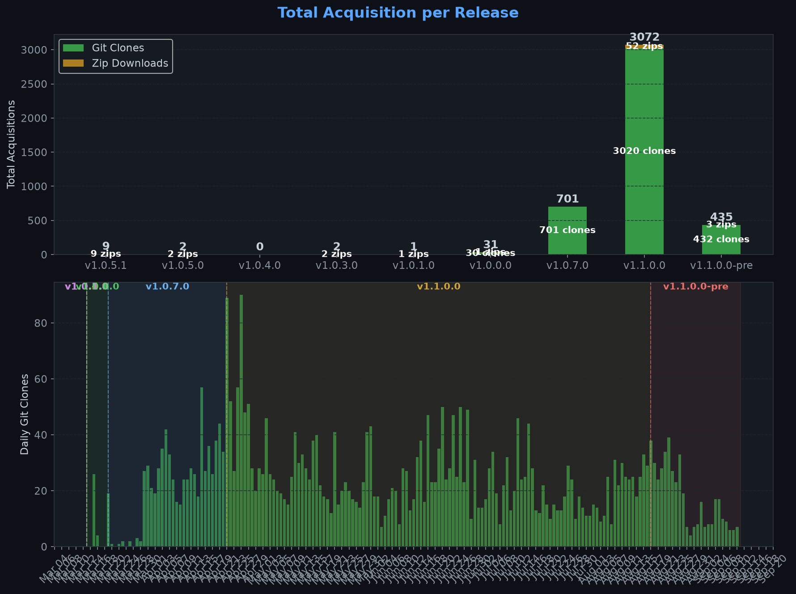
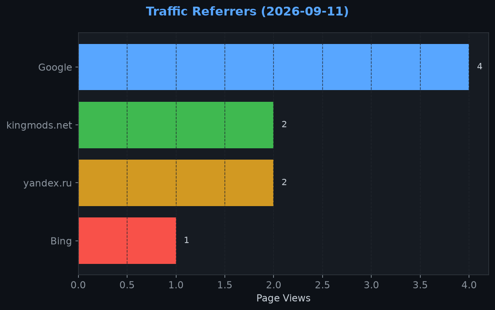
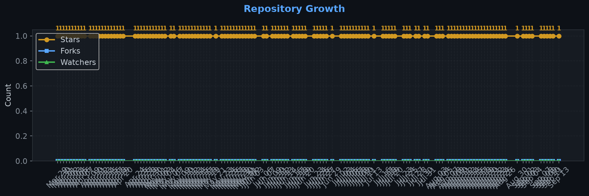

# Repository Traffic Dashboard

**Last updated:** 2026-09-11T18:07:46Z
**Days tracked:** 134 | **Download snapshots:** 305 (hourly)

---

## Views & Clones (14-day window, preserved forever)

| Metric | 14-Day Total | Unique |
|--------|-------------|--------|
| Page Views | 11 | 9 |
| Git Clones | 130 | 42 |

> **Engagement:** 1.2 pages per visitor (14-day avg)

---

## Visitor Engagement

> Higher = visitors exploring more pages. 1.0 = bounce. 3.0+ = deeply engaged.

---

## Conversion Funnel

> **14-day conversion:** 112 of 9 visitors cloned or downloaded (**1244.4%**)
>
> Unique cloners: 42 | Release downloads: 70

---

## Total Acquisition per Release (Downloads + Clones)

| Channel | Count |
|---------|-------|
| Zip Downloads | 70 |
| Git Clones (14-day) | 130 |
| **Total Acquisitions** | **200** |

---

## Referrers

| Source | Views | Unique |
|--------|-------|--------|
| Google | 4 | 3 |
| kingmods.net | 2 | 2 |
| yandex.ru | 2 | 1 |
| Bing | 1 | 1 |

---

## Repository Growth

| Metric | Current |
|--------|---------|
| Stars | 1 |
| Forks | 0 |
| Watchers | 0 |

---

## Top Pages (14-day)

| Page | Views | Unique |
|------|-------|--------|
| `/TheCodingDad-TisonK/FS25_CustomTriggerCreator` | 9 | 9 |
| `/TheCodingDad-TisonK/FS25_CustomTriggerCreator/blob/main/docs/screenshots/ctc_new1.png` | 1 | 1 |
| `/TheCodingDad-TisonK/FS25_CustomTriggerCreator/releases/tag/v1.1.0.0` | 1 | 1 |

---

## Data Files

| File | Description | Granularity |
|------|-------------|-------------|
| [daily.json](daily.json) | Views & clones per day (never expires) | Daily |
| [downloads.json](downloads.json) | Release download snapshots | Hourly |
| [referrers.json](referrers.json) | Referrer snapshots | Daily |
| [metadata.json](metadata.json) | Stars, forks, watchers | Daily |
| [stats.json](stats.json) | Combined legacy snapshots | 6-hourly |

---
*Hourly download tracking + full dashboard with engagement metrics every 6 hours*
*Auto-generated by [traffic-stats.yml](../../.github/workflows/traffic-stats.yml)*
